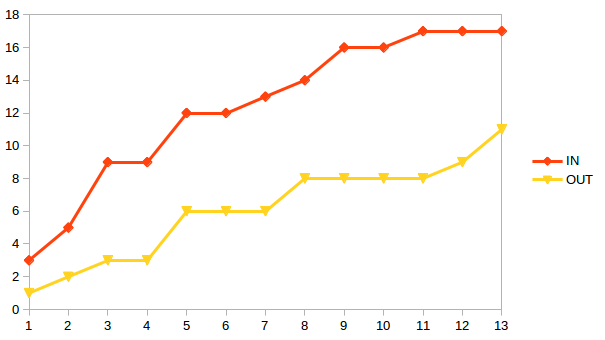

<!-- theme: uncover -->

# Store traffic counter
- Architecture
- Metrics
- Next steps

---

# Architecture 

  
  

  

    Some text 

  

---
# Demo

  
  

  

<iframe width="560" height="315" src="https://www.youtube.com/embed/fTa3V7cLA48" frameborder="0" allow="accelerometer; autoplay; encrypted-media; gyroscope; picture-in-picture" allowfullscreen></iframe>
